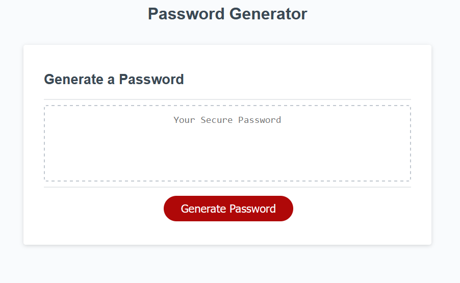
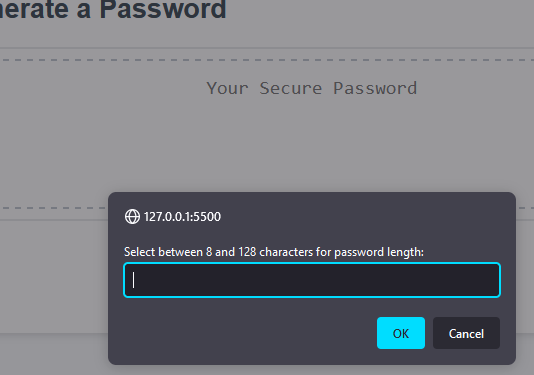
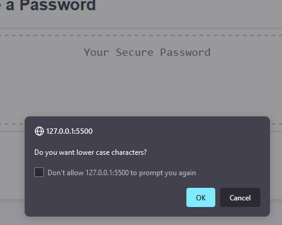
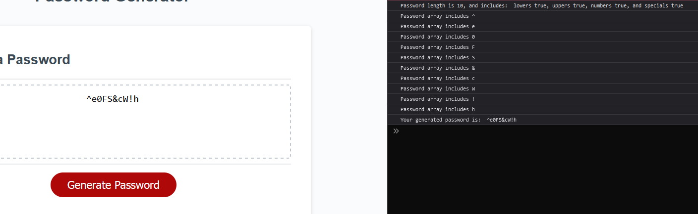
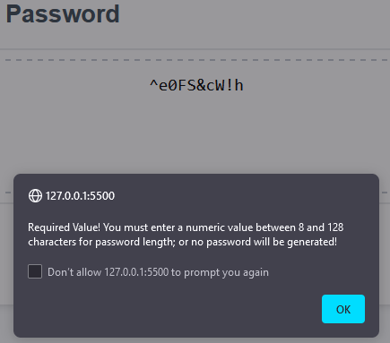

# MVR-bootcamp-challenge-3

## Password Generator code writing in Javascript
This repository is to write a button click based password generator that takes inputs from the user seeking to get a randomly generated password.

## Usage
This repository is used as a random password generator in whole as is by user opening the HTML file into a web browser when ever teh user needs a password.
[Deployed application](https://vrich88.github.io/MVR-bootcamp-challenge-3/)
User clicks the "Generate Password" button and is prompted with requests for inputs to choose the factors that make up the parameters of the random password.

If user fails to meet minimum required inputs of a numeric based length between 8 & 128 characters and at least one character type from lower case, upper case, numbers and/or special characters; the user is alerted with an error message resetting the prompt request and telling the user to start over with clicking the button.

Viewing the console.log will show the results of the user inputs and the result of the functions to generate the random password.

## License
MIT License

Copyright (c) 2023 vrich88

Permission is hereby granted, free of charge, to any person obtaining a copy
of this software and associated documentation files (the "Software"), to deal
in the Software without restriction, including without limitation the rights
to use, copy, modify, merge, publish, distribute, sublicense, and/or sell
copies of the Software, and to permit persons to whom the Software is
furnished to do so, subject to the following conditions:

The above copyright notice and this permission notice shall be included in all
copies or substantial portions of the Software.

THE SOFTWARE IS PROVIDED "AS IS", WITHOUT WARRANTY OF ANY KIND, EXPRESS OR
IMPLIED, INCLUDING BUT NOT LIMITED TO THE WARRANTIES OF MERCHANTABILITY,
FITNESS FOR A PARTICULAR PURPOSE AND NONINFRINGEMENT. IN NO EVENT SHALL THE
AUTHORS OR COPYRIGHT HOLDERS BE LIABLE FOR ANY CLAIM, DAMAGES OR OTHER
LIABILITY, WHETHER IN AN ACTION OF CONTRACT, TORT OR OTHERWISE, ARISING FROM,
OUT OF OR IN CONNECTION WITH THE SOFTWARE OR THE USE OR OTHER DEALINGS IN THE
SOFTWARE.
